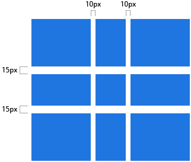

# CSS Grid 布局
<!-- TOC -->

- [CSS Grid 布局](#css-grid-布局)
    - [History of Layout](#history-of-layout)
    - [What is CSS Grid ?](#what-is-css-grid-)
    - [浏览器支持](#浏览器支持)
    - [基础用法](#基础用法)
    - [重要术语](#重要术语)
        - [Grid Container](#grid-container)
        - [Grid Item](#grid-item)
        - [Grid Line](#grid-line)
        - [Grid Track](#grid-track)
        - [Grid Cell](#grid-cell)
        - [Grid Area](#grid-area)
    - [网格属性](#网格属性)
        - [网格容器属性](#网格容器属性)
            - [display](#display)
            - [grid-template-columns | grid-template-rows](#grid-template-columns--grid-template-rows)
            - [grid-template-areas](#grid-template-areas)
            - [grid-template](#grid-template)
            - [grid-column-gap | grid-row-gap](#grid-column-gap--grid-row-gap)
            - [grid-gap](#grid-gap)
            - [justify-items](#justify-items)
            - [align-items](#align-items)
            - [place-items](#place-items)
            - [justify-content](#justify-content)
            - [align-content](#align-content)
            - [place-content](#place-content)
            - [grid-auto-columns | grid-auto-rows](#grid-auto-columns--grid-auto-rows)
            - [grid-auto-flow](#grid-auto-flow)
            - [grid](#grid)
        - [网格项属性](#网格项属性)
            - [grid-column-start | grid-column-end | grid-row-start | grid-row-end](#grid-column-start--grid-column-end--grid-row-start--grid-row-end)
            - [grid-column | grid-row](#grid-column--grid-row)
            - [grid-area](#grid-area)
            - [justify-self](#justify-self)
            - [align-self](#align-self)
            - [place-self](#place-self)
    - [Examples](#examples)
    - [动画](#动画)
    - [参考](#参考)

<!-- /TOC -->

## History of Layout
tables -> positioning -> inline-block： 遗留问题： 垂直居中

flexbox 基本可以解决横向和纵向布局的问题，但是它是为一维布局设置的，`flex-directions: rows / colums` 布局容器只能设置为一种属性。

css grid： 是第一个专门用于解决布局问题的css模块。
## What is CSS Grid ?
>  A two-dimensional grid-based layout system that aims to do nothing less than completely change the way we designed grid-based user interfaces.

二维的基于栅格的布局系统，完全改变了我们设计基于栅格用户界面的设计。
## 浏览器支持
当使用新的css样式的时候，浏览器是否支持已经成为我们必须要解决的问题之一。当css 用于布局的时候我们考虑的更多，例如 Flexbox 或者 CSS Grid。

## 基础用法

## 重要术语

### Grid Container
采用 `display: grid` 布局的元素，称为网格容器（Grid Container）。它是所有网格子项的直接父元素。

````html
<div class="container">
  <div class="item item-1"></div>
  <div class="item item-2"></div>
  <div class="item item-3"></div>
</div>
````

### Grid Item
网格项网格容器的直接子项。例如下面这段代码中 `item` 是 grid容器 的子项，而 `sub-item` 不是。
````html
<div class="container">
  <div class="item"></div>
  <div class="item">
  	<p class="sub-item"></p>
  </div>
  <div class="item"></div>
</div>
````

### Grid Line
网格线是网格系统的分界线。可以是垂直的（"column grid lines"）或者水平的("row grid lines")，并且同时存在与行和列。下面黄色的线是列栅格线。


### Grid Track
网格轨道两个相邻的栅格线中间的区域。即是网格的行和列。下面第二条和第三条网格线的中间就是网格轨道。


### Grid Cell
网络单元格是CSS网格中的最小单元。它是四条网格线之间的空间。下面的网络单元格是第1和第2条行网格线，第3和第4条网格线之间的内容。


### Grid Area
网格区域是被四个单元格包裹的区域，是网格中有一个或者多个网络单元格组成的一个矩形区域。


## 网格属性

### 网格容器属性
(这个地方可以弄一个目录)

#### display
指定元素为网格属性并为其内容创建一个栅格计算上下文。

可选值：
- `grid` - 生成块级网格
- `inline-grid` - 生成行内级别网格

````css
.container {
    display: grid | inline-grid;
}
````
注意: 将网格参数通过子网格传递给下去的功能移到了[ css 网络指南2](https://www.w3.org/TR/css-grid-2/#subgrids)。[快速预览指南](https://css-tricks.com/grid-level-2-and-subgrid/)。

#### grid-template-columns | grid-template-rows
通过一组空格分开的值来定义网格行和列。这个值代表网格轨道的大小。他们之间的空格则表示网格线。
可选值：
- `<track-size>` - 可以是长度，百分比或者是分数（使用 `fr` 为单位）
- `<line-name>` - 任意的名字都可以

```` css
.container {
  grid-template-columns: <track-size> ... | <line-name> <track-size> ...;
  grid-template-rows: <track-size> ... | <line-name> <track-size> ...;
}
````

**例子**

当网格轨道值置空时，网格线将自动分配正负值。
````css
.container {
  grid-template-columns: 40px 50px auto 50px 40px;
  grid-template-rows: 25% 100px auto;
}
````


但是你可以选择给网格线命名。请注意行命名的括号语法：
````css
.container {
  grid-template-columns: [first] 40px [line2] 50px [line3] auto [col4-start] 50px [five] 40px [end];
  grid-template-rows: [row1-start] 25% [row1-end] 100px [third-line] auto [last-line];
}
````


注意，一条网格线可以拥有多个名字。例如，下面第二条线有两个名字： `row1-end` 和 `row2-start`

````css
.container {
  grid-template-rows: [row1-start] 25% [row1-end row2-start] 25% [row2-end];
}
````

如果您的定义包含重复的部分，您可以使用 `repeat()` 来简写:
````css
.container {
  grid-template-columns: repeat(3, 20px [col-start]);
}
````

下面代码等同于下面：
````css
.container {
  grid-template-columns: [col-start] 20px [col-start] 20px [col-start] 20px;
}
````

如果多个网格线拥有相同的名字，您可以通过它们的名字和个数来引用：
````css
.item {
  grid-column-start: col-start 2;
}

````
`fr`单位允许你设置网格轨道大小设置为网格容器可用空间的一部分。例如，下面每一项都是网格容器宽度的三分之二。
````css
.container {
  grid-template-columns: 1fr 1fr 1fr;
}
````

可用空间是网格空间内容没有被计算的空间。在下面这个例子当中，可用的`fr`单位总空间不包含50px:
````css
.container {
  grid-template-columns: 1fr 50px 1fr 1fr;
}
````

#### grid-template-areas
通过引用指定`grid-area`属性的网格项的网格区域名称来定义网格模板。重复一个网格区域的名字会使内容跨越所有单元格。一个句点代表一个空的单元格。语法本省提供可视化的网格结构。

可选值：
- `<grid-area-name>`: 网格项[grid-area](#grid-area)定义的值
- `.`: 一个句点代表一个空的网格单元
- `none`: 没有定义网格区域
````css
.container {
  grid-template-areas:
    "<grid-area-name> | . | none | ..."
    "...";
}
````

例如：
````css
.item-a {
  grid-area: header;
}
.item-b {
  grid-area: main;
}
.item-c {
  grid-area: sidebar;
}
.item-d {
  grid-area: footer;
}

.container {
  grid-template-columns: 50px 50px 50px 50px;
  grid-template-rows: auto;
  grid-template-areas:
    "header header header header"
    "main main . sidebar"
    "footer footer footer footer";
}
````
这段代码将创建一个4*3的网格区域，整个最顶层的行将由**header**区域组成，中间第二行的区域是有两个**main**区域，一个空单元格，和一个**sidebar**区域组成。最有一行所有区域都是**footer**。


你定义的每一行都需要有相同的单元格数。
你可以使用任意相邻的区域来定义一个空的单元格。只要区域间没有空间，就代表一个单元格。
注意这段语法不是用来定义网格线，是定义网格区域的。当你使用这个语法，区域中所有的线都呗自动命名。如果网格区域定义为**foo**，这个区域的起始横向和纵向网格线将被命名为**foo-start**，横向和纵向结束网格线将被命名为**foo-end**。这意味着有些网格线将可能拥有多个名字，例如，上面例子中的最左边那条线拥有三个名字：header-start、main-start和footer-start。

#### grid-template
一行定义 [grid-template-columns](#grid-template-columns--grid-template-rows)，[grid-template-rows](#grid-template-columns--grid-template-rows)和[grid-template-areas](#grid-template-areas)属性的简写。

可选值：
- `none`: 设置所有的三个属性为初始值。
- `<grid-template-rows> / <grid-template-columns>`：分别设置[grid-template-columns](#grid-template-columns--grid-template-rows)和[grid-template-rows](#grid-template-columns--grid-template-rows)为指定值。并且设置[grid-template-areas](#grid-template-areas)为`none`。

```css
.container {
  grid-template: none | <grid-template-rows> / <grid-template-columns>;
}
````
它也接受一个复杂但是相当敏捷的语法来定义所有三个属性。例如：
````css
.container {
  grid-template:
    [row1-start] "header header header" 25px [row1-end]
    [row2-start] "footer footer footer" 25px [row2-end]
    / auto 50px auto;
}
````
等同于：
````css
.container {
  grid-template-rows: [row1-start] 25px [row1-end row2-start] 25px [row2-end];
  grid-template-columns: auto 50px auto;
  grid-template-areas:
    "header header header"
    "footer footer footer";
}
````

由于`grid-template`不重置隐式属性（[grid-auto-columns](#grid-auto-columns--grid-auto-rows)，[grid-auto-rows](#grid-auto-columns--grid-auto-rows) 和 [grid-auto-flow](#grid-auto-flow)），这些属性可能在多数情况下会被使用。所以建议用[grid](#grid)属性来代替`grid-template`。

#### grid-column-gap | grid-row-gap
指定网格线之间间隔大小。你可以想象成设置网格行/列之间的高度。

可选值：
- `<line-size>`: 一个长度值
````css
.container {
  grid-column-gap: <line-size>;
  grid-row-gap: <line-size>;
}
````

例子：
````css
.container {
  grid-template-columns: 100px 50px 100px;
  grid-template-rows: 80px auto 80px;
  grid-column-gap: 10px;
  grid-row-gap: 15px;
}
````


间隔只在网格行/列之间创建，不包含外部边缘。

注意：该属性的`grid-`前缀将被自动删除，`grid-column-gap`和`grid-row-gap`被命名为`column-gap`和`row-gap`。Chrome 68+，Safari 11.2 Release 50+ 和 Opera 54+ 已经支持该属性不加前缀。

#### grid-gap

[grid-column-gap](#grid-column-gap--grid-row-gap) 和 [grid-row-gap](#grid-column-gap--grid-row-gap)的简写。

可选值：
- `<grid-row-gap> <grid-column-gap> `: 长度值
````
.container {
  grid-gap: <grid-row-gap> <grid-column-gap>;
}
````

例子：
````css
.container {
  grid-template-columns: 100px 50px 100px;
  grid-template-rows: 80px auto 80px;
  grid-gap: 15px 10px;
}
````
如果没有指定[grid-row-gap](#grid-column-gap--grid-row-gap)，将设置为和[grid-column-gap](#grid-column-gap--grid-row-gap)同样的值。

注意：该属性的`grid-`前缀将被自动删除，`grid-column-gap`被命名为`gap`。Chrome 68+，Safari 11.2 Release 50+ 和 Opera 54+ 已经支持该属性不加前缀。

#### justify-items

#### align-items

#### place-items

#### justify-content

#### align-content

#### place-content

#### grid-auto-columns | grid-auto-rows

#### grid-auto-flow

#### grid


### 网格项属性
**注意：**

`float`, `display: inline-block`, `display: tabel-cell`, `vertical-align`和`column-*`等属性对网格项无效。

#### grid-column-start | grid-column-end | grid-row-start | grid-row-end
指定特定的网格线可以决定一个网格项在网格中的位置。`rid-column-start` / `grid-row-start` 定义网格项的起始位置的网格线， `grid-row-start` / `grid-row-end` 定义网格项的结束位置的网格线。

可选值：

- `<line>`: 可以是已编号网格线的编号或者是已命名网格线的名称。
- `span <number>`: 网格项将跨越提供的网格轨道数。
- `span <name>`: 网格项将跨越直至至提供名称的网格线。
- `auto`: 表示自动定位，自动的跨度，或者默认一个跨度范围。

```` css
.item {
  grid-column-start: <number> | <name> | span <number> | span <name> | auto
  grid-column-end: <number> | <name> | span <number> | span <name> | auto
  grid-row-start: <number> | <name> | span <number> | span <name> | auto
  grid-row-end: <number> | <name> | span <number> | span <name> | auto
}
````
示例：
```` css
.item-a {
  grid-column-start: 2;
  grid-column-end: five;
  grid-row-start: row1-start
  grid-row-end: 3;
}
````


```` css
.item-b {
  grid-column-start: 1;
  grid-column-end: span col4-start;
  grid-row-start: 2
  grid-row-end: span 2
}
````


如果 `grid-column-end` / `grid-row-end` 没有定义，网格项将默认跨越一个轨道。网格项之间可以重叠，你可以通过定义 `z-index`来控制他们之间堆叠的顺序。

#### grid-column | grid-row
 `grid-column-start` + `grid-column-end` 和 `grid-row-start` + `grid-row-end` 各自的简写

 可选值：
- `<start-line> / <end-line>` 每个值都接受所有普通写法的值，包括span
````css
.item {
  grid-column: <start-line> / <end-line> | <start-line> / span <value>;
  grid-row: <start-line> / <end-line> | <start-line> / span <value>;
}
````
示例：
````css
.item-c {
  grid-column: 3 / span 2;
  grid-row: third-line / 4;
}
````


如果没有定义结束网格线的值，将默认跨越一个网格轨道。

#### grid-area
给网格项定义一个名称，这个名称可以被通过 [grid-template-areas](#grid-template-areas)属性 创建的模板引用，或者，这个属性可以作为 `grid-row-start` + `grid-column-start` + `grid-row-end` + `grid-column-end` 属性更加简洁的简写。

可选值：
 - `<name>`: 你选择的任意名称
 - `<row-start> / <column-start> / <row-end> / <column-end>`：可以是一组数字或者一组已定义的网格线。

````css
.item {
  grid-area: <name> | <row-start> / <column-start> / <row-end> / <column-end>;
}
````

示例：

作为网格项命名的一种方式：
```` css
.item-d {
  grid-area: header
}
````

`grid-row-start` + `grid-column-start` + `grid-row-end` + `grid-column-end`的简写
````css
.item-d {
  grid-area: 1 / col4-start / last-line / 6
}
````


#### justify-self

#### align-self

#### place-self


## Examples

这个地方可以把所有 `css-grid` 的例子放出来（看情况Github 或者 jsFiddle 或者 codepen）

## 动画


## 参考
1. [learn-css-grid 资料汇总](http://jensimmons.com/post/feb-27-2017/learn-css-grid)

2. [CSS Grid complete Guide](https://css-tricks.com/snippets/css/complete-guide-grid/)

3. [A Guide to Flexbox](https://css-tricks.com/snippets/css/a-guide-to-flexbox/)

4. [About CSS Grid / MDN](https://developer.mozilla.org/en-US/docs/Web/CSS/CSS_Grid_Layout)

5. [Gridbyexample-exapmles, videos and patten from Rache Andrews](https://gridbyexample.com/)

6. [使用Grid部署网站-thomasnet](https://www.thomasnet.com/)