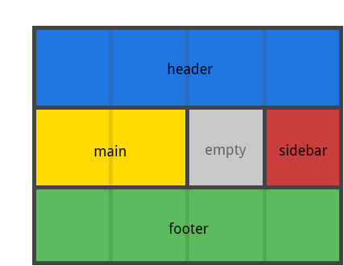
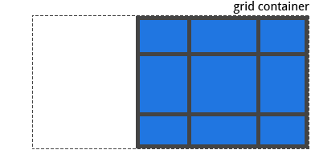
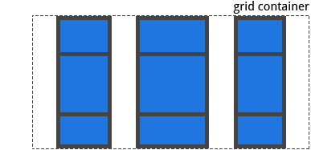
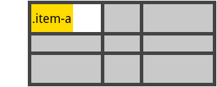
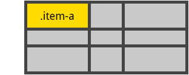
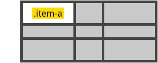

# CSS Grid 布局
<!-- TOC -->

- [CSS Grid 布局](#css-grid-布局)
    - [History of Layout](#history-of-layout)
    - [What is CSS Grid ?](#what-is-css-grid-)
    - [浏览器支持](#浏览器支持)
    - [基础用法](#基础用法)
    - [重要术语](#重要术语)
        - [Grid Container](#grid-container)
        - [Grid Item](#grid-item)
        - [Grid Line](#grid-line)
        - [Grid Track](#grid-track)
        - [Grid Cell](#grid-cell)
        - [Grid Area](#grid-area)
    - [网格属性](#网格属性)
        - [网格容器属性](#网格容器属性)
            - [display](#display)
            - [grid-template-columns | grid-template-rows](#grid-template-columns--grid-template-rows)
            - [grid-template-areas](#grid-template-areas)
            - [grid-template](#grid-template)
            - [grid-column-gap | grid-row-gap](#grid-column-gap--grid-row-gap)
            - [grid-gap](#grid-gap)
            - [justify-items](#justify-items)
            - [align-items](#align-items)
            - [place-items](#place-items)
            - [justify-content](#justify-content)
            - [align-content](#align-content)
            - [place-content](#place-content)
            - [grid-auto-columns | grid-auto-rows](#grid-auto-columns--grid-auto-rows)
            - [grid-auto-flow](#grid-auto-flow)
            - [grid](#grid)
        - [网格项属性](#网格项属性)
            - [grid-column-start | grid-column-end | grid-row-start | grid-row-end](#grid-column-start--grid-column-end--grid-row-start--grid-row-end)
            - [grid-column | grid-row](#grid-column--grid-row)
            - [grid-area](#grid-area)
            - [justify-self](#justify-self)
            - [align-self](#align-self)
            - [place-self](#place-self)
    - [Examples](#examples)
    - [动画](#动画)
    - [参考](#参考)

<!-- /TOC -->

## History of Layout
tables -> positioning -> inline-block： 遗留问题： 垂直居中

flexbox 基本可以解决横向和纵向布局的问题，但是它是为一维布局设置的，`flex-directions: rows / colums` 布局容器只能设置为一种属性。

css grid： 是第一个专门用于解决布局问题的css模块。


## What is CSS Grid ?
>  A two-dimensional grid-based layout system that aims to do nothing less than completely change the way we designed grid-based user interfaces.

二维的基于栅格的布局系统，完全改变了我们设计基于栅格用户界面的设计。


## 浏览器支持
当使用新的css样式的时候，浏览器是否支持已经成为我们必须要解决的问题之一。当css 用于布局的时候我们考虑的更多，例如 Flexbox 或者 CSS Grid。

## 基础用法


## 重要术语


### Grid Container
采用 `display: grid` 布局的元素，称为网格容器（Grid Container）。它是所有网格子项的直接父元素。

````html
<div class="container">
  <div class="item item-1"></div>
  <div class="item item-2"></div>
  <div class="item item-3"></div>
</div>
````


### Grid Item
网格项网格容器的直接子项。例如下面这段代码中 `item` 是 grid容器 的子项，而 `sub-item` 不是。
````html
<div class="container">
  <div class="item"></div>
  <div class="item">
  	<p class="sub-item"></p>
  </div>
  <div class="item"></div>
</div>
````


### Grid Line
网格线是网格系统的分界线。可以是垂直的（"column grid lines"）或者水平的("row grid lines")，并且同时存在与行和列。下面黄色的线是列栅格线。


### Grid Track
网格轨道两个相邻的栅格线中间的区域。即是网格的行和列。下面第二条和第三条网格线的中间就是网格轨道。


### Grid Cell
网络单元格是CSS网格中的最小单元。它是四条网格线之间的空间。下面的网络单元格是第1和第2条行网格线，第3和第4条网格线之间的内容。


### Grid Area
网格区域是被四个单元格包裹的区域，是网格中有一个或者多个网络单元格组成的一个矩形区域。


## 网格属性

### 网格容器属性
(这个地方可以弄一个目录)

#### display
指定元素为网格属性并为其内容创建一个栅格计算上下文。

可选值：
- `grid` - 生成块级网格
- `inline-grid` - 生成行内级别网格

````css
.container {
    display: grid | inline-grid;
}
````
注意: 将网格参数通过子网格传递给下去的功能移到了[ css 网络指南2](https://www.w3.org/TR/css-grid-2/#subgrids)。[快速预览指南](https://css-tricks.com/grid-level-2-and-subgrid/)。

#### grid-template-columns | grid-template-rows
通过一组空格分开的值来定义网格行和列。这个值代表网格轨道的大小。他们之间的空格则表示网格线。
可选值：
- `<track-size>` - 可以是长度，百分比或者是分数（使用 `fr` 为单位）
- `<line-name>` - 任意的名字都可以

```` css
.container {
  grid-template-columns: <track-size> ... | <line-name> <track-size> ...;
  grid-template-rows: <track-size> ... | <line-name> <track-size> ...;
}
````

**例子**

当网格轨道值置空时，网格线将自动分配正负值。
````css
.container {
  grid-template-columns: 40px 50px auto 50px 40px;
  grid-template-rows: 25% 100px auto;
}
````


但是你可以选择给网格线命名。请注意行命名的括号语法：
````css
.container {
  grid-template-columns: [first] 40px [line2] 50px [line3] auto [col4-start] 50px [five] 40px [end];
  grid-template-rows: [row1-start] 25% [row1-end] 100px [third-line] auto [last-line];
}
````


注意，一条网格线可以拥有多个名字。例如，下面第二条线有两个名字： `row1-end` 和 `row2-start`

````css
.container {
  grid-template-rows: [row1-start] 25% [row1-end row2-start] 25% [row2-end];
}
````

如果您的定义包含重复的部分，您可以使用 `repeat()` 来简写:
````css
.container {
  grid-template-columns: repeat(3, 20px [col-start]);
}
````

下面代码等同于下面：
````css
.container {
  grid-template-columns: [col-start] 20px [col-start] 20px [col-start] 20px;
}
````

如果多个网格线拥有相同的名字，您可以通过它们的名字和个数来引用：
````css
.item {
  grid-column-start: col-start 2;
}

````
`fr`单位允许你设置网格轨道大小设置为网格容器可用空间的一部分。例如，下面每一项都是网格容器宽度的三分之二。
````css
.container {
  grid-template-columns: 1fr 1fr 1fr;
}
````

可用空间是网格空间内容没有被计算的空间。在下面这个例子当中，可用的`fr`单位总空间不包含50px:
````css
.container {
  grid-template-columns: 1fr 50px 1fr 1fr;
}
````


#### grid-template-areas
通过引用指定`grid-area`属性的网格项的网格区域名称来定义网格模板。重复一个网格区域的名字会使内容跨越所有单元格。一个句点代表一个空的单元格。语法本省提供可视化的网格结构。

可选值：
- `<grid-area-name>`: 网格项[grid-area](#grid-area)定义的值
- `.`: 一个句点代表一个空的网格单元
- `none`: 没有定义网格区域
````css
.container {
  grid-template-areas:
    "<grid-area-name> | . | none | ..."
    "...";
}
````

例如：
````css
.item-a {
  grid-area: header;
}
.item-b {
  grid-area: main;
}
.item-c {
  grid-area: sidebar;
}
.item-d {
  grid-area: footer;
}

.container {
  grid-template-columns: 50px 50px 50px 50px;
  grid-template-rows: auto;
  grid-template-areas:
    "header header header header"
    "main main . sidebar"
    "footer footer footer footer";
}
````
这段代码将创建一个4*3的网格区域，整个最顶层的行将由**header**区域组成，中间第二行的区域是有两个**main**区域，一个空单元格，和一个**sidebar**区域组成。最有一行所有区域都是**footer**。



你定义的每一行都需要有相同的单元格数。
你可以使用任意相邻的区域来定义一个空的单元格。只要区域间没有空间，就代表一个单元格。
注意这段语法不是用来定义网格线，是定义网格区域的。当你使用这个语法，区域中所有的线都呗自动命名。如果网格区域定义为**foo**，这个区域的起始横向和纵向网格线将被命名为**foo-start**，横向和纵向结束网格线将被命名为**foo-end**。这意味着有些网格线将可能拥有多个名字，例如，上面例子中的最左边那条线拥有三个名字：header-start、main-start和footer-start。


#### grid-template
一行定义 [grid-template-columns](#grid-template-columns--grid-template-rows)，[grid-template-rows](#grid-template-columns--grid-template-rows)和[grid-template-areas](#grid-template-areas)属性的简写。

可选值：
- `none`: 设置所有的三个属性为初始值。
- `<grid-template-rows> / <grid-template-columns>`：分别设置[grid-template-columns](#grid-template-columns--grid-template-rows)和[grid-template-rows](#grid-template-columns--grid-template-rows)为指定值。并且设置[grid-template-areas](#grid-template-areas)为`none`。

```css
.container {
  grid-template: none | <grid-template-rows> / <grid-template-columns>;
}
````
它也接受一个复杂但是相当敏捷的语法来定义所有三个属性。例如：
````css
.container {
  grid-template:
    [row1-start] "header header header" 25px [row1-end]
    [row2-start] "footer footer footer" 25px [row2-end]
    / auto 50px auto;
}
````
等同于：
````css
.container {
  grid-template-rows: [row1-start] 25px [row1-end row2-start] 25px [row2-end];
  grid-template-columns: auto 50px auto;
  grid-template-areas:
    "header header header"
    "footer footer footer";
}
````

由于`grid-template`不重置隐式属性（[grid-auto-columns](#grid-auto-columns--grid-auto-rows)，[grid-auto-rows](#grid-auto-columns--grid-auto-rows) 和 [grid-auto-flow](#grid-auto-flow)），这些属性可能在多数情况下会被使用。所以建议用[grid](#grid)属性来代替`grid-template`。

#### grid-column-gap | grid-row-gap
指定网格线之间间隔大小。你可以想象成设置网格行/列之间的高度。

可选值：
- `<line-size>`: 一个长度值
````css
.container {
  grid-column-gap: <line-size>;
  grid-row-gap: <line-size>;
}
````

例子：
````css
.container {
  grid-template-columns: 100px 50px 100px;
  grid-template-rows: 80px auto 80px;
  grid-column-gap: 10px;
  grid-row-gap: 15px;
}
````


间隔只在网格行/列之间创建，不包含外部边缘。

注意：该属性的`grid-`前缀将被自动删除，`grid-column-gap`和`grid-row-gap`被命名为`column-gap`和`row-gap`。Chrome 68+，Safari 11.2 Release 50+ 和 Opera 54+ 已经支持该属性不加前缀。


#### grid-gap
[grid-column-gap](#grid-column-gap--grid-row-gap) 和 [grid-row-gap](#grid-column-gap--grid-row-gap)的简写。

可选值：
- `<grid-row-gap> <grid-column-gap> `: 长度值
````
.container {
  grid-gap: <grid-row-gap> <grid-column-gap>;
}
````

例子：
````css
.container {
  grid-template-columns: 100px 50px 100px;
  grid-template-rows: 80px auto 80px;
  grid-gap: 15px 10px;
}
````
如果没有指定[grid-row-gap](#grid-column-gap--grid-row-gap)，将设置为和[grid-column-gap](#grid-column-gap--grid-row-gap)同样的值。

注意：该属性的`grid-`前缀将被自动删除，`grid-column-gap`被命名为`gap`。Chrome 68+，Safari 11.2 Release 50+ 和 Opera 54+ 已经支持该属性不加前缀。

#### justify-items
基于行/横轴来对齐网格项（与[align-items](#align-items)基于列/纵轴对齐相反）。该值适用于容器内所有的网格项。

可选值：
- `start`: - 对齐所有单元格内元素的起始边缘
- `ebd`: - 对齐所有单元格内元素的结束边缘
- `center`: - 居中对齐所有单元格的元素
- `stretch` - 填充单元格的总的总宽度（默认值）

```` css
.container {
  justify-items: start | end | center | stretch;
}
````

例子：
```` css
.container {
  justify-items: start;
}
````


```` css
.container{
  justify-items: end;
}
````


```` css
.container{
  justify-items: center;
}
````


```` css
.container{
  justify-items: stretch;
}
````


该行为也可以通过[justify-self](#justify-self)属性设置在每个独立的网格项上


#### align-items
基于列/纵轴来对齐网格项（与[justify-items](#justify-items)基于/横轴对齐相反）。该值适用于容器内所有的网格项。

可选值：
- `start`: - 对齐所有单元格内元素的起始边缘
- `ebd`: - 对齐所有单元格内元素的结束边缘
- `center`: - 居中对齐所有单元格的元素
- `stretch` - 填充单元格的总的总宽度（默认值）

```` css
.container {
  align-items: start | end | center | stretch;
}
````

例子：
```` css
.container {
  align-items: start;
}
````


```` css
.container{
  align-items: end;
}
````


```` css
.container{
  align-items: center;
}
````


```` css
.container{
  align-items: stretch;
}
````


该行为也可以通过[align-self](#align-self)属性设置在每个独立的网格项上

#### place-items
`place-items` 可在同时设置 `align-items` 和 `justify-items` 属性。

可选值：
 - `<align-items> / <justify-items>`: - 第一个值设置 `align-items`的值，第二个值设置设置 `justify-item` 的值。如果第二个值省略了，那么第一个值将同时被分配给这两个属性。

 所有的主流浏览器除了微软的Edge外都支持 **place-items** 的缩写。想要了解更多，请参考[align-items](#align-items)和[justify-items](#justify-items)

#### justify-content
某些情况下你设置的网格的大小可能比网格容器要小。这种场景可能发生在非弹性布局单位`px`上。在这种情况下，你可以设置网格在网格容器内的对齐方式。该属性基于行/横轴来对齐网格（与[align-content](#align-content)基于列/纵轴线对齐网格相反）。

可选值：

- `start` - 使网格项对齐网格容器的开始边缘
- `end` - 使网格项对齐网格容器的结束边缘
- `center` - 使网格项对齐网格容器的中间边缘
- `stretch ` - 调整网格项大小使整个网格的宽度填满整个网格容器
- `space-around` -　在所有网格中间放置相等间隔的空白，并在网格与网格容器边缘的两边留出该间隔一半大小的空白
- `space-between` - 在所有网格中间放置相等间隔的空白，不包括网格和网格容器边缘。
- `space-evenly` - 在所有网格项之间放置相等间隔的空白，包括网格和网格容器的边缘。

```` css
.container {
  justify-content: start | end | center | stretch | space-around | space-between | space-evenly;
}
````

例子：
```` css
.container {
  justify-content: start;
}
````


```` css
.container {
  justify-content: end;
}
````


```` css
.container {
  justify-content: center;
}
````


```` css
.container {
  justify-content: stretch;
}
````


```` css
.container {
  justify-content: space-around;
}
````


```` css
.container {
  justify-content: space-between;
}
````


```` css
.container {
  justify-content: space-evenly;
}
````



#### align-content
某些情况下你设置的网格的大小可能比网格容器要小。这种场景可能发生在非弹性布局单位`px`上。在这种情况下，你可以设置网格在网格容器内的对齐方式。该属性基于列/纵横轴来对齐网格（与[justify-content](#justify-content)基于行/横轴线对齐网格相反）。 

可选值：

- `start` - 使网格项对齐网格容器的开始边缘
- `end` - 使网格项对齐网格容器的结束边缘
- `center` - 使网格项对齐网格容器的中间边缘
- `stretch ` - 调整网格项大小使整个网格的高度填满整个网格容器
- `space-around` -　在所有网格中间放置相等间隔的空白，并在网格与网格容器边缘的两边留出该间隔一半大小的空白
- `space-between` - 在所有网格中间放置相等间隔的空白，不包括网格和网格容器边缘。
- `space-evenly` - 在所有网格项之间放置相等间隔的空白，包括网格和网格容器的边缘。

````
.container {
  align-content: start | end | center | stretch | space-around | space-between | space-evenly;	
}
````

例子：
```` css
.container {
  align-content: start;
}
````


```` css
.container {
  align-content: end;
}
````


```` css
.container {
  align-content: center;
}
````


```` css
.container {
  align-content: stretch;
}
````


```` css
.container {
  align-content: space-around;
}
````


```` css
.container {
  align-content: space-between;
}
````


```` css
.container {
  align-content: space-evenly;
}
````


#### place-content
`place-content` 可在同一行同时设置 `align-content` 和 `justify-content`属性。

可选值：
- `<align-content> / <justify-content>` - 第一个值设置 `align-content` ，第二个值设置 `justify-content`。如果没有设置第二个值，第一个值将同时赋给这两个属性。

所有主流浏览器除了Edge外都支持 `place-content` 的缩写方式。

欲了解更多，请参考[align-content](#align-content)和[justify-content](#justify-content)。


#### grid-auto-columns | grid-auto-rows
指定所有自动生成的网格轨道（例如：隐性的网格轨道）的大小。当网格项的数量大于网格布局的单元格的数量时或者当一个网格项被置于一个显性轨单元格的外面的时候，隐性轨道就会被创建出来。（[显性轨道和隐性轨道的区别](https://css-tricks.com/difference-explicit-implicit-grids/)）。

可选值：
- `<track-size>` - 可以时长度大小、百分比或者是网格中空白区域的占比（使用`fr`单位）

````css
.container {
  grid-auto-columns: <track-size> ...;
  grid-auto-rows: <track-size> ...;
}
````
为了说明隐性轨道时怎样创建的，请先看下面的布局：
````css
.container {
  grid-template-columns: 60px 60px;
  grid-template-rows: 90px 90px
}
````


该布局创建列一个2*2的网格。

现在想象下你用`grid-column` 和 `grid-row`来用以下方式设置你的网格项：
````css
.item-a {
  grid-column: 1 / 2;
  grid-row: 2 / 3;
}
.item-b {
  grid-column: 5 / 6;
  grid-row: 2 / 3;
}
````


我们设置 .item-b 开始于第5列并结束于第6列，**但是我们没有定义第5或者第6列**。由于我们的参考线并不存在，宽度为0的隐性轨道将被创建出来填满这些间隙。我们可以用`grid-auto-columns`和`grid-auto-rows` 来指定这些隐性轨道的宽度。

````css
.container {
  grid-auto-columns: 60px;
}
````


#### grid-auto-flow
如果在网格中你有没有指定确切位置的网格项，*auto-placement algorithm*算法将会介入，自动设置网格项的位置。这个属性控制自动布局的计算。

可选参数：
- `row` - 该属性告诉自动布局算法，依次将网格项放到每一行，如果有需要的话，添加新的行。（默认值）
- `column` - 该属性告诉自动布局算法，依次将网格项放到每一列，如果有需要的话，添加新的列。
- `dense` - 该属性告诉自动布局算法, 如果更小的网格项出现，尝试早点填充网格里面的空白。

````css
.container {
  grid-auto-flow: row | column | row dense | column dense
}
````
注意：**dense**属性只改变网格项视觉上的排序，而且有可能导致乱序，这会严重影响使用便捷性。

例子：

假设html代码：
````html
<section class="container">
  <div class="item-a">item-a</div>
  <div class="item-b">item-b</div>
  <div class="item-c">item-c</div>
  <div class="item-d">item-d</div>
  <div class="item-e">item-e</div>
</section>
````
你定义了一个5列和2行的网格。并且设置`grid-auto-flow`为`row`（默认值）。

````css
.container {
  display: grid;
  grid-template-columns: 60px 60px 60px 60px 60px;
  grid-template-rows: 30px 30px;
  grid-auto-flow: row;
}
````
设置网格项在网格中的位置，仅指定2个网格项：
````css
.item-a {
  grid-column: 1;
  grid-row: 1 / 3;
}
.item-e {
  grid-column: 5;
  grid-row: 1 / 3;
}
````
由于我们将`grid-auto-flow`属性设置为`row`，我们的网格将如下图所示。注意我们没有设置位置的三个网格项（**item-b**，**item-c** 和 **item-d** ）是如何在已有的列中浮动:


如果我们将`grid-auto-flow`属性设置为`column`，**item-b**，**item-c** 和 **item-d** 会沿着列浮动:
````css
.container {
  display: grid;
  grid-template-columns: 60px 60px 60px 60px 60px;
  grid-template-rows: 30px 30px;
  grid-auto-flow: column;
}
````


#### grid
用一行可设置下面所有属性的缩写 [grid-template-rows](#grid-template-columns--grid-template-rows), [grid-template-columns](#grid-template-columns--grid-template-rows), [grid-template-areas](#grid-template-areas), [grid-auto-rows](#grid-auto-columns--grid-auto-rows), [grid-auto-columns](#grid-auto-columns--grid-auto-rows), and [grid-auto-flow](#grid-auto-flow)。（注意：你只能用一行来定义显性或者隐性网格属性）。

可选值：

- `none` - 设置所有子属性为其初始值。

- `<grid-template>` - 和[grid-template](#grid-template)简写是一样的

- `<grid-template-rows> / [ auto-flow && dense? ] <grid-auto-columns>?` - 设置[grid-template-rows](#grid-template-columns--grid-template-rows)为指定值。如果`auto-flow` 关键词在斜杠右边，将设置grid-template-rows](#grid-template-columns--grid-template-rows)属性为`column`。如果`dense`关键词额外加在后面，自动布局算法将用“dense”填充方式。如果没有设置[grid-auto-columns](#grid-auto-columns--grid-auto-rows)属性，它的值将设置为`auto`。

- `[ auto-flow && dense? ] <grid-auto-rows>? / <grid-template-columns>` - 设置[grid-template-columns](#grid-template-columns--grid-template-rows)为指定值。如果`auto-flow` 关键词在斜杠左边，将设置[grid-auto-rows](#grid-auto-columns--grid-auto-rows)属性为`row`。如果`dense`关键词额外加在后面，自动布局算法将用“dense”填充方式。如果没有设置[grid-template-rows](#grid-template-columns--grid-template-rows)属性，它的值将设置为`auto`。

例子：

下面两端代码是相等的：
````css
.container {
    grid: 100px 300px / 3fr 1fr;
  }
````

````css
.container {
    grid-template-rows: 100px 300px;
    grid-template-columns: 3fr 1fr;
  }
````

下面两端代码是相等的：
````css
.container {
    grid: auto-flow / 200px 1fr;
}
````

````css
.container {
    grid-auto-flow: row;
    grid-template-columns: 200px 1fr;
}
````  

下面两端代码是相等的：
````css
.container {
    grid: auto-flow dense 100px / 1fr 2fr;
}
````

````css
.container {
    grid-auto-flow: row dense;
    grid-auto-rows: 100px;
    grid-template-columns: 1fr 2fr;
}
```` 


下面两端代码也是相等的：
````css
.container {
    grid: 100px 300px / auto-flow 200px;
}
````

````css
.container {
    grid-template-rows: 100px 300px;
    grid-auto-flow: column;
    grid-auto-columns: 200px;
}
```` 

它接受更复杂但是便捷的语法来一次性设置所有的值。你指定[grid-template-areas](#grid-template-areas), [grid-template-rows](#grid-template-columns--grid-template-rows) 和 [grid-template-columns](#grid-template-columns--grid-template-rows)并且设置所有其他的子属性都设置为其初始值。你所做的只需要指定各自网格区域的网格线的名称和网格轨道的大小。结合例子来看描述会更简单点：

````css
.container {
    grid: [row1-start] "header header header" 1fr [row1-end]
          [row2-start] "footer footer footer" 25px [row2-end]
          / auto 50px auto;
  }
````

等同于下面这段代码：
````css
.container {
    grid-template-areas: 
      "header header header"
      "footer footer footer";
    grid-template-rows: [row1-start] 1fr [row1-end row2-start] 25px [row2-end];
    grid-template-columns: auto 50px auto;    
  }
```` 


### 网格项属性
**注意：**

`float`,  `display: inline-block`,  `display: tabel-cell`, `vertical-align` 和 `column-*` 等属性对网格项无效。

#### grid-column-start | grid-column-end | grid-row-start | grid-row-end
指定特定的网格线可以决定一个网格项在网格中的位置。`rid-column-start` / `grid-row-start` 定义网格项的起始位置的网格线， `grid-row-start` / `grid-row-end` 定义网格项的结束位置的网格线。

可选值：

- `<line>`: 可以是已编号网格线的编号或者是已命名网格线的名称。
- `span <number>`: 网格项将跨越提供的网格轨道数。
- `span <name>`: 网格项将跨越直至至提供名称的网格线。
- `auto`: 表示自动定位，自动的跨度，或者默认一个跨度范围。

```` css
.item {
  grid-column-start: <number> | <name> | span <number> | span <name> | auto
  grid-column-end: <number> | <name> | span <number> | span <name> | auto
  grid-row-start: <number> | <name> | span <number> | span <name> | auto
  grid-row-end: <number> | <name> | span <number> | span <name> | auto
}
````
示例：
```` css
.item-a {
  grid-column-start: 2;
  grid-column-end: five;
  grid-row-start: row1-start
  grid-row-end: 3;
}
````


```` css
.item-b {
  grid-column-start: 1;
  grid-column-end: span col4-start;
  grid-row-start: 2
  grid-row-end: span 2
}
````


如果 `grid-column-end` / `grid-row-end` 没有定义，网格项将默认跨越一个轨道。网格项之间可以重叠，你可以通过定义 `z-index`来控制他们之间堆叠的顺序。


#### grid-column | grid-row
 `grid-column-start` + `grid-column-end` 和 `grid-row-start` + `grid-row-end` 各自的简写

 可选值：
- `<start-line> / <end-line>` 每个值都接受所有普通写法的值，包括span
````css
.item {
  grid-column: <start-line> / <end-line> | <start-line> / span <value>;
  grid-row: <start-line> / <end-line> | <start-line> / span <value>;
}
````
示例：
````css
.item-c {
  grid-column: 3 / span 2;
  grid-row: third-line / 4;
}
````


如果没有定义结束网格线的值，将默认跨越一个网格轨道。

#### grid-area
给网格项定义一个名称，这个名称可以被通过 [grid-template-areas](#grid-template-areas)属性 创建的模板引用，或者，这个属性可以作为 `grid-row-start` + `grid-column-start` + `grid-row-end` + `grid-column-end` 属性更加简洁的简写。

可选值：
 - `<name>`: 你选择的任意名称
 - `<row-start> / <column-start> / <row-end> / <column-end>`：可以是一组数字或者一组已定义的网格线。

````css
.item {
  grid-area: <name> | <row-start> / <column-start> / <row-end> / <column-end>;
}
````

示例：

作为网格项命名的一种方式：
```` css
.item-d {
  grid-area: header
}
````

`grid-row-start` + `grid-column-start` + `grid-row-end` + `grid-column-end`的简写
````css
.item-d {
  grid-area: 1 / col4-start / last-line / 6
}
````


#### justify-self
在一个网格单元格中基于行/横轴来对齐网格项自身（与[align-self](#align-self)基于列/纵轴相反）。该值应用于放置在单个单元格的网格项。

可选值：

- `start` - 使网格项对齐单元格的开始边缘
- `end` - 使网格项对齐单元格的结束边缘
- `center` - 使网格项对齐单元格的中间边缘
- `stretch ` - 调整网格项大小使整个网格的宽度填满整个单元格（默认值）

```` css
.item {
  justify-self: start | end | center | stretch;
}
````

例子：

```` css
.item {
  justify-self: start;
}
````


```` css
.item {
  justify-self: end;
}
````


```` css
.item {
  justify-self: center;
}
````


```` css
.item {
  justify-self: stretch;
}
````


设置网格中所有网格项的对齐，可以通过设置网格容器的[justify-content](#justify-content)属性来实现。

#### align-self
在一个网格单元格中基于列/纵轴来对齐网格项自身（与[justify-self](#justify-self)基于行/横轴相反）。该值应用于放置在单个单元格的网格项。

可选值：

- `start` - 使网格项对齐单元格的开始边缘
- `end` - 使网格项对齐单元格的结束边缘
- `center` - 使网格项对齐单元格的中间边缘
- `stretch ` - 调整网格项大小使整个网格的高度填满整个单元格（默认值）

```` css
.item {
  align-self: start | end | center | stretch;
}
````

例子：

```` css
.item {
  align-self: start;
}
````


```` css
.item {
  align-self: end;
}
````


```` css
.item {
  align-self: center;
}
````


```` css
.item {
  align-self: stretch;
}
````


设置网格中所有网格项的对齐，可以通过设置网格容器的[align-content](#align-content)属性来实现。


#### place-self
`place-self` 可在同一行同时设置 `align-self` 和 `justify-self`属性。

可选值：
-  `auto` - 布局模式下的默认对齐凡事
- `<align-self> / <justify-self>` - 第一个值设置 `align-self` ，第二个值设置 `justify-self`。如果没有设置第二个值，第一个值将同时赋给这两个属性。

例子：

````css
.item-a {
  place-self: center;
}
````


````css
.item-a {
  place-self: center strecth;
}
````


所有主流浏览器除了Edge外都支持 `place-self` 的缩写方式。


## 动画
参考 CSS Grid Layout Module Level 1 specification，有5个网格属性有动画特性：

- `grid-gap`,`grid-row-gap`, `grid-column-gap` 的长度，百分比和计算属性（calc)等。
- `grid-template-columns`, `grid-template-rows`的列表的长度，百分比和计算属性（calc)等，唯一的区别是列表中提供的属性的长度，百分比和计算组建（calc)等的值。

[css 网格布局动画参考](https://code·pen.io/matuzo/pen/rmQvMG)

## 参考·

1. [CSS Grid complete Guide](https://css-tricks.com/snippets/css/complete-guide-grid/)

2. [learn-css-grid 资料汇总](http://jensimmons.com/post/feb-27-2017/learn-css-grid)

3. [A Guide to Flexbox](https://css-tricks.com/snippets/css/a-guide-to-flexbox/)

4. [About CSS Grid / MDN](https://developer.mozilla.org/en-US/docs/Web/CSS/CSS_Grid_Layout)

5. [Gridbyexample-exapmles, videos and patten from Rache Andrews](https://gridbyexample.com/)

6. [使用Grid部署网站-thomasnet](https://www.thomasnet.com/)